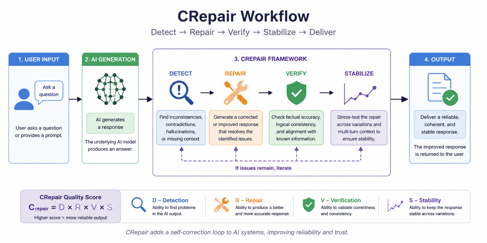

# CRepair: AI Coherence Repair Framework

Final project for the Building AI course

## Summary

CRepair is an AI framework designed to detect, repair, verify, and stabilize reasoning failures in artificial intelligence systems. Instead of only generating answers, the system evaluates whether responses remain logically coherent and self-consistent over time.

Building AI course project.

---

## Background

Modern AI systems are becoming increasingly capable, but they still frequently produce unreliable outputs. Large language models may generate contradictions, hallucinate facts, forget previous context, or drift away from the original task.

Problems this idea attempts to solve:

* hallucinated information
* contradictory responses
* context loss during long interactions
* unstable reasoning chains
* lack of self-correction mechanisms

This problem is becoming increasingly important because AI systems are now used in:

* education
* healthcare
* research
* software development
* decision support systems

My personal motivation comes from my interest in AI cognition and long-term reasoning. Current AI systems are powerful, but often lack mechanisms for detecting and correcting their own failures.

---

## How is it used?

CRepair acts as a runtime layer between a user and an AI system.

Typical workflow:

1. User asks a question
2. AI generates an answer
3. CRepair evaluates consistency
4. If problems are found:
   * detect the issue
   * repair the issue
   * verify the repair
   * test long-term stability
5. Return improved output

Example:

```text
User:
"Explain why Earth is round"

AI:
"The Earth is approximately spherical"

Later:

"The Earth is flat"

CRepair:
Contradiction detected
Repair initiated
Corrected response generated
```

Suggested project image:



---

## Data sources and AI methods

Potential data sources:

* AI conversation logs
* benchmark datasets
* synthetic contradiction datasets
* open-source LLM outputs
* reasoning evaluation datasets

Methods used:

| Method | Purpose |
|----------|----------|
| Natural Language Processing | Analyze generated text |
| Classification | Detect inconsistencies |
| Anomaly Detection | Identify unusual reasoning |
| Large Language Models | Generate repairs |
| Confidence Estimation | Evaluate reliability |

Core evaluation idea:

```text
C_repair = D × R × V × S

D = Detection
R = Repair
V = Verification
S = Stability
```

---

## Challenges

The system does not completely solve:

* subjective disagreements
* philosophical questions
* hidden reasoning failures
* highly ambiguous situations

Potential limitations:

* increased computational cost
* false positives
* possible overcorrection
* dependency on evaluation quality

Ethical considerations:

* users should understand when responses are modified
* repair mechanisms should remain transparent
* systems should avoid changing valid information incorrectly

---

## What next?

Future development ideas:

* real-time monitoring dashboards
* integration with LLM systems
* multimodal AI support
* autonomous repair pipelines
* open-source community collaboration

Long-term goal:

Create AI systems capable of maintaining long-term coherent reasoning.

---

## Acknowledgments

Sources of inspiration:

* Elements of AI course
* AI safety research
* language model evaluation research
* predictive processing ideas
* work on hallucination detection

Related project:

https://github.com/kaminovs/crepair

Project author:

Sergey Kaminov
